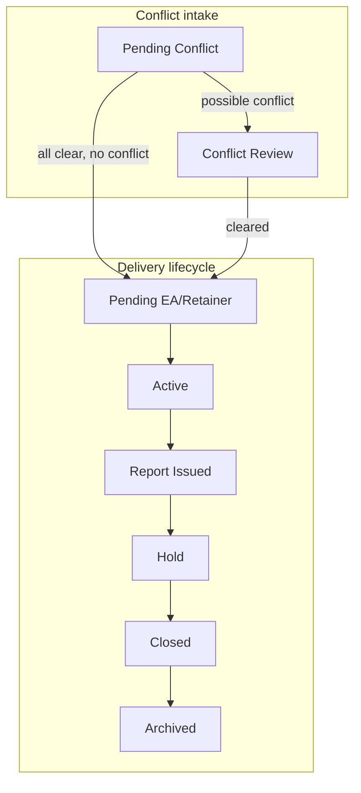

# Project status workflow (reference)

Statuses are defined in `src/types/index.ts` as `ProjectStatus`. The app does not enforce a strict state machine everywhere (e.g. edit project can set any status), but **conflict checks** drive these transitions via `src/app/api/conflict/respond/route.ts`:

- **`pending_conflict`** → **`conflict_review`** if any recipient reports a possible conflict.
- **`pending_conflict`** → **`pending_ea_retainer_auth`** when all recipients answered and none reported conflict.

From **`conflict_review`**, the UI can move to **`pending_ea_retainer_auth`** (e.g. “Clear conflict” on the project page).

After conflict checks clear (no possible conflict, or conflict cleared in app), the project moves to **`Pending EA/Retainer`** (`pending_ea_retainer_auth`). It advances to **`Active`** automatically when:

- **Master (general) template:** tasks **Engagement Agreement** and **Retainer Invoice?** are both completed, or  
- **Appraisal template:** task **Authorization Received** is completed.

Then the **typical delivery pipeline** continues:

`active` → `report_issued` → `hold` → `closed` → `archived`

*(There is no separate “Billing” project status; use **Hold** when work pauses before closeout.)*

## Mermaid (default)

Use **Admin/PIC → Status workflow** in the app for an editable diagram and copyable Mermaid.

